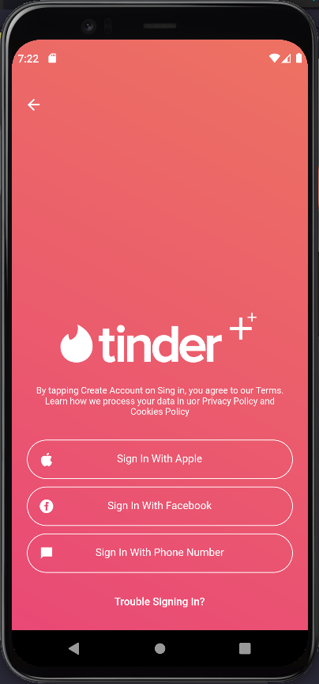

# Finance app and Tinder++

## Resouces
### Widgets
- Column
- Row
- Stack
- Image
- InkWell
- Padding
- Align

### Custom
- Stateless Widgets for buttons
- Apply context to get properties from WidgetTree:
  - Routing with Navigator `Navigator.of(context)`
  - Style with Theme`Theme.of(context)`

## Apps
### Finance

### Tinder++

### Gif

---

[< Voltar](../README.md)
