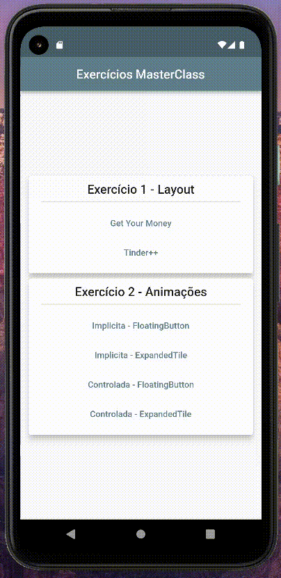

# Implicity and Controlled Animations

## Resouces
### Widgets
- Animated[widget]:
  - AnimatedContainer
  - AnimatedAlign
  - ...
  - [Flutter implicity animation catalog](https://docs.flutter.dev/development/ui/widgets/animation)

- Controlled animation
  - AnimationController
  - Animation
  - Tween(double, int)
  - ColorTween
  - Curved Animation
  - ...
  - [Flutter animation controlled](https://docs.flutter.dev/development/ui/animations/tutorial)

## App

---

[< Voltar](../README.md)
